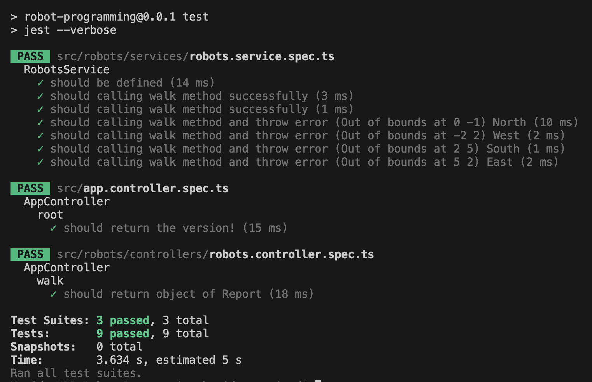
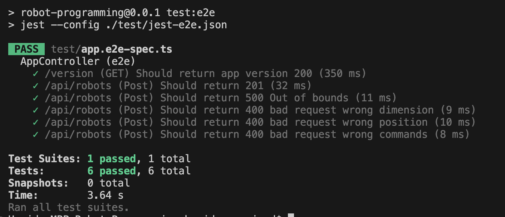
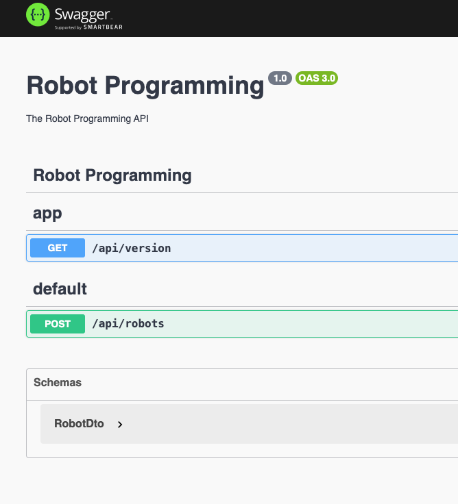

<h1>Robot Programming Backend</h1>

Hi.

Task is to program the controller to a robot. It’s a simple robot that can walk around in a room where the floor is represented as a number of fields in a wire mesh. Input is first two numbers, which tells the robot how big the room is: 5 7
Which means that the room is 5 fields wide and is 7 fields deep.
The size of the room follows two digits and one letter indicating the starting position of the robot and its orientation in space. For

example:
Which means that the robot is in field (3, 3) and faces north. Subsequently, the robot receives a number of navigation commands in the form of characters. The following commands shall be implemented:
• L Turn left
• R Turn right
• F Walk forward
Example:
LFFRFRFRFF
If the robot walks outside of the room bounds the program should exit with an error code.
After the last command is received, the robot must report which field it is in and what direction it is facing.

Example:

5 5 <br>
1 2 N <br>
RFRFFRFRF <br>
Report: 1 3 N <br>

5 5 <br>
0 0 E <br>
RFLFFLRF <br>
Report: 3 1 E <br>

3 3 <br>
2 2 N <br>
FFLFFRF <br>
ERROR: Out of bounds at 0 -1

## Used Technologies and Patterns

- NestJS - The main structure of the application.
- Swagger - To generate open API document.
- Jest - JavaScript Testing Framework
- Supertest - HTTP assertions test

## Main Sections

- API endpoints

## API endpoints

- Robots APIs for movement.

## Postman documents

Postman API endpoint documents and environment are available in the postman-docs folder.

## Installation

```bash
$ npm install
```

## Running the app

```bash
# development
$ npm start

# watch mode
$ npm run start:dev

# production mode
$ npm run start:prod
```

## Test

Separate DB is used for testing purposes and it is managed properly.

```bash
# Eslint
$ npm run lint

# unit tests
$ npm run test

# e2e tests
$ npm run test:e2e

# test coverage
$ npm run test:cov
```

 
<br>


## API Document

Swagger is used to generate API documents automatically. Follow below steps to see the document.

1. Run the application

```bash
$ npm run start
```

2. Open the following address `http://localhost:3000/docs/` in browser



## App is running

```bash
$ http://localhost:3000
```
